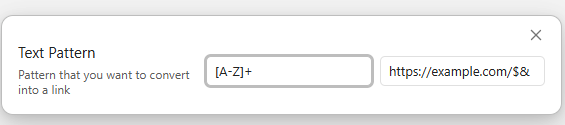
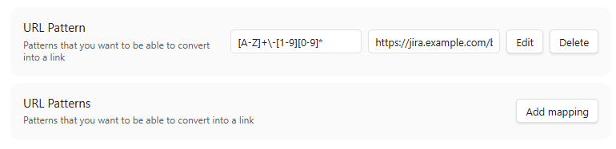

# URL Recognizer Plugin

This is a plugin for Obsidian (https://obsidian.md).

This project uses TypeScript to provide type checking and documentation.
The repo depends on the latest plugin API (obsidian.d.ts) in TypeScript Definition format, which contains TSDoc comments describing what it does.

This plugin facilitates the creation of URLs from configurable textual patterns.
It can detect text  fragments in your Obsidian notes that matches a given regular expression and transform these fragments into navigable links that point to a URL computed from the fragment matched.

## Usage

The default shortcut is Ctrl+Space, but it can be changed in the Obsidian settings.
It must be invoked with the whole text to replace the selected text by the URL (if it matches the regular expression).

## Settings

By default, there is one sample setting defined with a single mapping that can be configured.
This mapping is just provided as an example, don't expect it to be useful as is.

Additional mappings can be added if necessary (by clicking on 'Add mapping').
The first mapping that matches the selected text will be applied to produce a text+link.

