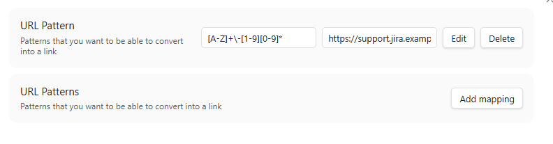

# URL Recognizer Plugin

This is a plugin for Obsidian (https://obsidian.md).

This project uses TypeScript to provide type checking and documentation.
The repo depends on the latest plugin API (obsidian.d.ts) in TypeScript Definition format, which contains TSDoc comments describing what it does.

This plugin facilitates the creation of URLs from configurable textual patterns. With it, you can set a regular expression to replace the text that match by another thing. 

## Usage

The default shortcut is Ctrl+Space, but you can change it if you want .

It must be invoked with the whole text to replace the selected text (if it matches the regular expression) by the URL.

## Settings

You can set other regular expression for different uses, but you also can change and remove previous one.
You also can change the URL it brings you to.

